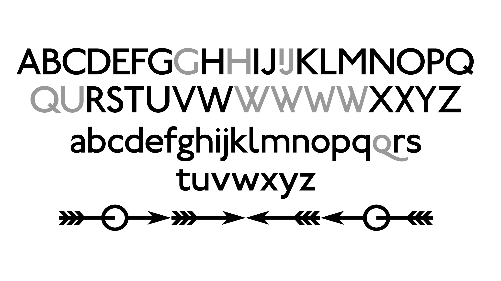

Metropolitan Line
============

<p align="center">
  <picture>
    <source media="(prefers-color-scheme: dark)" srcset="./documentation/cover_dark.svg">
    <source media="(prefers-color-scheme: light)" srcset="./documentation/cover.svg">
    
  </picture>
An open source version of Edward Johnston's Timeless Typeface for London Underground of 1916
  <picture>
    <source media="(prefers-color-scheme: dark)" srcset="./documentation/image1_dark.svg">
    <source media="(prefers-color-scheme: light)" srcset="./documentation/image1.svg">
    
  </picture>
  <picture>
    <source media="(prefers-color-scheme: dark)" srcset="./documentation/image2_dark.svg">
    <source media="(prefers-color-scheme: light)" srcset="./documentation/image2.svg">
    
</picture>
</p>

## About

Metropolitan Line is a derivative of Railway Sans by Justin Howes, and Greg Fleming.

Railway Sans is a previously unpublished work, originally digitised by my late friend and partner, the typographer Justin Howes, in 1994, some seventy-eight years after the first appearance of Johnston's Railway type in 1916. Using an old SPARC station, some bitmap-to-vector software which I'd written which output in ASCII Type 3 font format and a Crosfield drum scanner to initially capture the outlines, these were then converted from bitmaps into vector font data. Justin had wanted to capture and make an experimental font of this version, drawn directly from Johnston's original artwork of 1913-1915 as part of the book he was writing on Edward Johnston and other Johnston-related research, and later revisions and variations which were originally the only characters in the typeface in various samples and working proofs kindly lent by Andrew Johnston.

This version of the original Johnston typeface of 1916, in both TrueType and OpenType format, will work with Macs, Linux and Windows computers and will provide authenticity when recreating Underground signage. This is why I am making this version available for enthusiasts who seek an authentic-looking digital version of the original Underground type. It is not derived from the Banks's and Miles New Johnston Sans (so brilliantly realised by Eiichi Kono, 1979). Nor is it a copy or in any way a facsimile of any existing commercial typeface, such as P22's excellent version, Underground. It is rendered entirely from proofs done by Edward Johnston himself at the time the face was commissioned.

See [typotech.blogspot.co.uk web archive](https://web.archive.org/web/20130422193825/http://typotech.blogspot.com/) for more background.

## Building

Fonts are built automatically by GitHub Actions - take a look in the "Actions" tab for the latest build.

If you want to build fonts manually on your own computer:

- `make build` will produce font files.
- `make test` will run [FontBakery](https://github.com/googlefonts/fontbakery)'s quality assurance tests.
- `make proof` will generate HTML proof files.

The proof files and QA tests are also available automatically via GitHub Actions - look at `https://cyrealtype.github.io/metropolitan-line`.

## Copyright

```
Copyright 1994 Justin Howes. An Unpublished work from Justin Howes.
Copyright 2012 Greg Fleming, with Reserved Font Name "Railway".
Copyright 2026 The Metropolitan Line Authors (https://github.com/cyrealtype/metropolitan-line).
```

## License

This Font Software is licensed under the SIL Open Font License, Version 1.1.
This license is available with a FAQ at https://openfontlicense.org

## Repository Layout

This font repository structure is inspired by [Unified Font Repository v0.3](https://github.com/unified-font-repository/Unified-Font-Repository), modified for the Google Fonts workflow.

